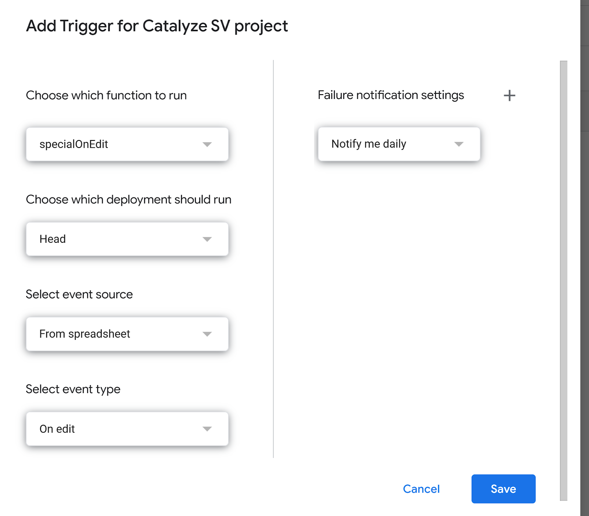
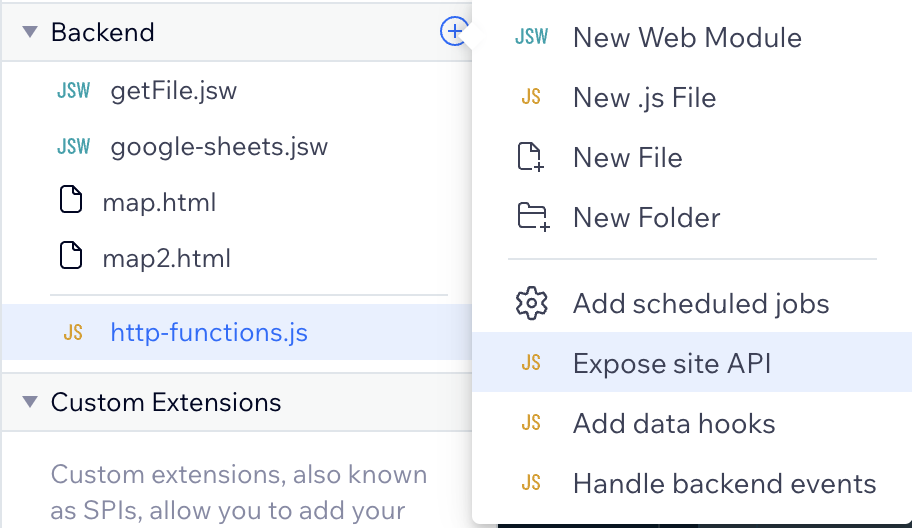
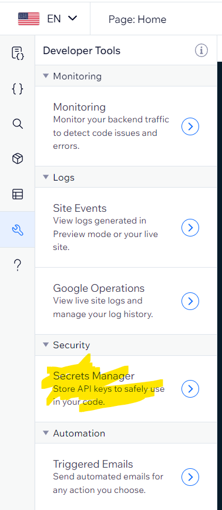
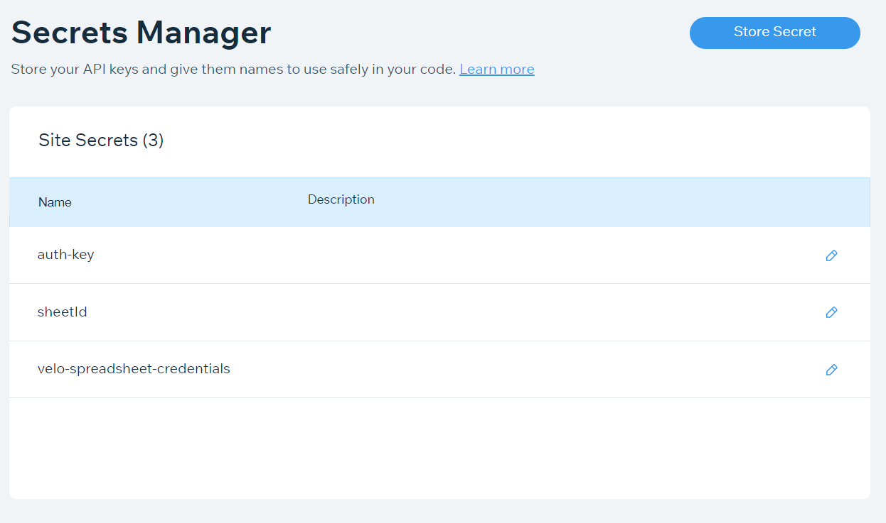
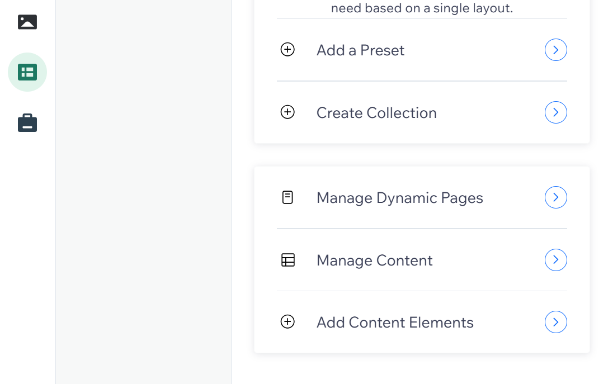
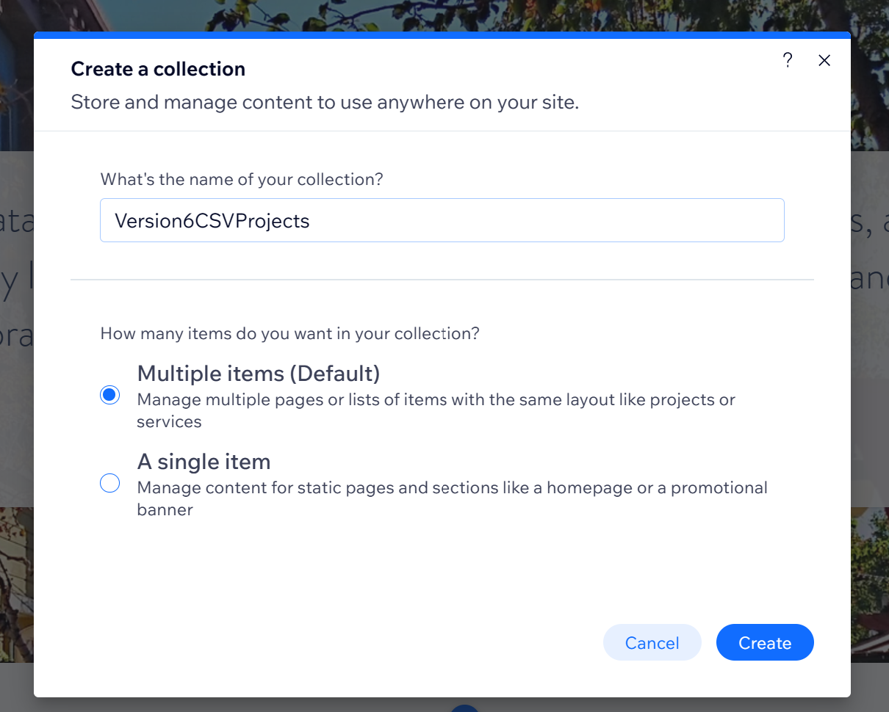
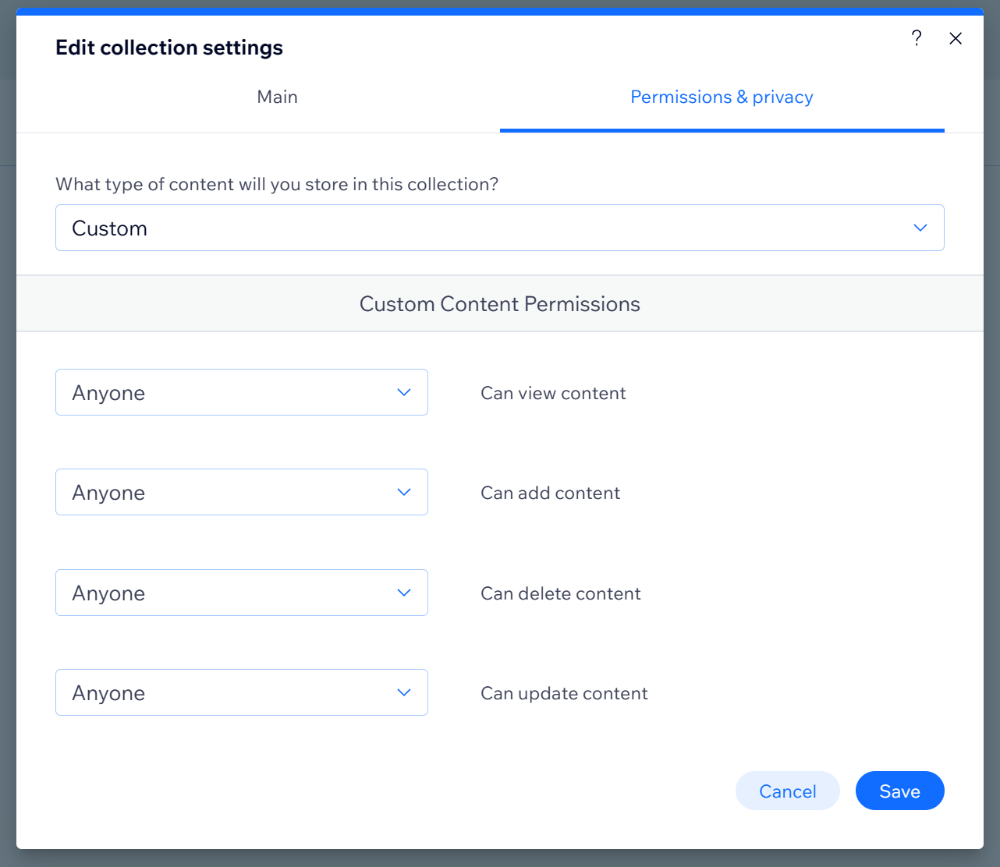
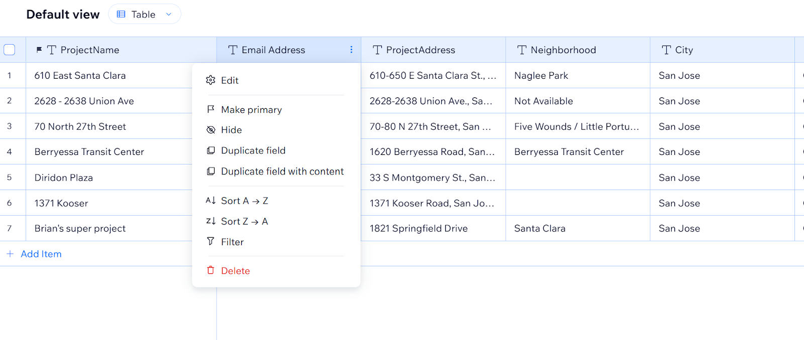
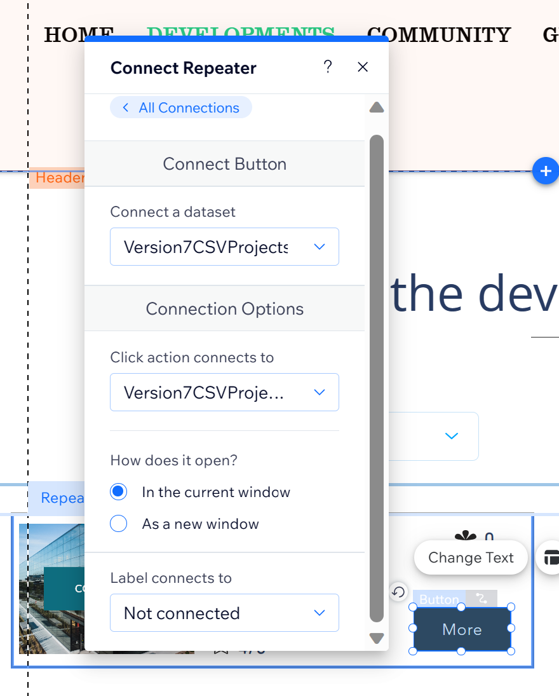

# Setup Dataset, Dynamic Pages on Wix for SHAPESV

This document is a recipe book to get you setup for working on wix for the development of the ShapeSV tool.
([Google docs version](https://docs.google.com/document/d/1foV9fmRzNxvTpc4aMJwBFG2IvgyP7jlBxQowVDJtFKs/edit))
If access is required, ask Shalini

## What you need:

1. Wix account, Copy of CatalyzeSV website with editor privileges (Ask Shalini)
2. [Master Spreadsheet](https://docs.google.com/spreadsheets/d/1jug0VQuns9ZwcCeat5iy7oN1IzBlQCzkmKLbA5S0xFs/edit?usp=drive_link) of Project Details
3. [Images for Wix Dataset Folder](https://drive.google.com/drive/folders/1IQs6KfGGthgawOlzEIkwbAdj5w_LWug1?usp=drive_link)
4. Access to catalyzesv Design3 Site

## Steps:

1. Create a folder on your Google Drive
2. Make a Copy of the [Images for Wix Dataset](https://drive.google.com/drive/folders/1IQs6KfGGthgawOlzEIkwbAdj5w_LWug1?usp=drive_link) in the Google Drive folder from Step 1
3. Make a Copy of the [Master Spreadsheet](https://docs.google.com/spreadsheets/d/1jug0VQuns9ZwcCeat5iy7oN1IzBlQCzkmKLbA5S0xFs/edit?usp=drive_link) in the Google Drive folder from Step 1
4. Open your copy of Master Spreadsheet, Rename it.
5. On the Spreadsheet, On the Menu→Extensions →Apps Script, [See the Code](./google-spreadsheet-code.js)
6. Modify the WIX_URL on the line 1 to match your published URL
7. Setup Trigger (On the left bar clock icon is for Triggers)
8. Click “+ Add Trigger” (At the bottom right) and select as shown below & Save

   - 

9. Allow Google account to work with Apps Script
10. [Create a Dataset in Wix](#create-a-dataset-in-wix) with the same name as the “Version7CSVProjects” in the master spreadsheet
11. IMPORT the copy of Master Spreadsheet in Version7CSVProjects Dataset
12. Change the datatype of each data (Detail of Datatypes Link here)
13. Change the Permissions of the Dataset (Public)
14. [Wix Code Expose API](#wix-code---expose-api)
15. Copy the landing page called “ShapeSV” from the Design1 site
16. Copy the “ShapeSV List” Page from the Design1 site, [Connect each element to the Dataset (List Page Link here)](#connect-dataset-in-wix-to-the-list-page)
17. Copy the “ShapeSV Detail Page” from the Design1 site, [Connect each element to the Dataset (Detail Page Link here)](#connect-dataset-in-wix-to-the-detail-page)
18. Wix Code for Search
19. Test!

## Google Spreadsheet - Instructions for Apps Script

[Code](./google-spreadsheet-code.js)

## Wix Code - Expose API

1. On your wix site, add a new file by clicking the plus and selecting “Expose site API”
   - 
2. Then copy and paste the entire code from below into the file.
   - [Code](./wix-http-functions.js)

## Create an AUTH-KEY secret in wix

1. Open up the “Secrets Manger” (found on the left side of the wix screen) to create a secret.
2. Then click “Store Secret”
3. Set the name to “auth-key” and set it to any type of string.
   - Ex: “super-duper-secret”
   - Recommended to be at least 32 characters.
   - REMEMBER THIS SECRET STRING TO UPDATE THE GOOGLE APP SCRIPTS “AUTH_KEY”
   - 
   - 

## Create a Dataset in Wix

- Click CMS
- Manage Content
- Create Collection
- Give a name to the collection
- Edit Permission Settings





**Make sure WIX_URL is correct in AppScript and to update the AUTH_KEY**

```
const WIX_URL = "https://SOMETHING.wixsite.com"; //CHANGE

// Folder is in same folder as the this Spreadsheet
const IMAGE_FOLDER = "Images For Wix Dataset"; //CHANGE
const AUTH_KEY = "SECRET"; //UPDATE WITH SECRET FROM WIX

// Set true to send to live collection, false for sandbox
const IS_PRODUCTION = true; //CHANGE (goes to live, false goes to Sandbox in Wix Dataset)
```

**Now go to your spreadsheet and start Saving 1 Row at a time and verify the Data in Wix**

Make **Project Name** the Primary Key and Edit Data Type of some fields according to the master spreadsheet “Notes Tab” [Master Spreadsheet](https://docs.google.com/spreadsheets/d/1jug0VQuns9ZwcCeat5iy7oN1IzBlQCzkmKLbA5S0xFs/edit?usp=drive_link)

Generic Image,
Custom Image (Image)
Link to the Website (URL)
Detail Project Type is Tags
All the rest Data type by default is Object Type (Make them Text)

**Save all the other 6 projects (They go to Live Collection)**

## Connect Dataset in Wix to the List Page

- Import CSV with all fields
- Make it Custom in Wix Content Manager Settings (Permissions & Privacy)
- Change the Data types for all fields

[Connect the following columns to the list page:](https://docs.google.com/spreadsheets/u/0/d/1jug0VQuns9ZwcCeat5iy7oN1IzBlQCzkmKLbA5S0xFs/edit) **Go to the Notes Tab for the latest**


## Connect Dataset in Wix to the Detail Page

Make the Master Detail Page as Dynamic Page
Add the Dataset and
[Connect the following columns to the list page:](https://docs.google.com/spreadsheets/u/0/d/1jug0VQuns9ZwcCeat5iy7oN1IzBlQCzkmKLbA5S0xFs/edit) **Go to the Notes Tab for the latest**
**Connect the More Button in one of the Repeater to the Dynamic Page (Click Action Connects To)**

